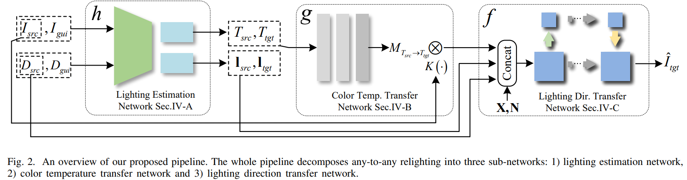

# PNRNet

Code for PNRNet: Physically-inspired Neural Rendering for Any-to-Any Relighting.

## Method Overview
We present a deep learning-based method that incorporates the physical principles of image formation into our neural rendering design, with the aim of eliminating the task-aliasing effects and maintaining the attached-shadow details.



Examples results:


## Dependencies and Installation
This code requires [PyTorch 1.7+](https://pytorch.org/) and [python 3+](https://www.python.org/downloads/). Also, please install other dependencies by

    pip install -r requirements.txt

## Testing

Test our pretrained model on the NTRIE 2021 Relighting Track2 validation set. 

You should set a config file in configs/config_test.json, and run as following:

    python test.py

Before running the above script, you need to download the [[pretrained model](https://pan.baidu.com/s/1GGmy7fMQF9zoF4aFMVU5jQ)]  (code: n3ne) and put it in the folder pretrained_models. 

You also need to download the NTRIE 2021 Track2 [[validation set](https://pan.baidu.com/s/1NpwTJ2kvZJp3_V2G7L40PA)]  (code: 0td8) and unzip it to the folder Datasets/NTIRE2021_Challenge.


## Training

Train three sub-networks (i.e., LENet, CTTNet and LDTNet) on the NTRIE 2021 Relighting Track2 training set separately.

### Data Preparation

You should download the [[train data](https://datasets.epfl.ch/vidit/NTIRE2021/track2_train.zip)] and unzip it to the folder Datasets/NTIRE2021_Challenge. 

We also provide [[normal map](https://pan.baidu.com/s/1seevN5F7rJtuj5J0QhLK3g)]  (code: hv5w) and [[position map](https://pan.baidu.com/s/1yy0_XJS697ILafLQHYCkig)]  (code: ir2f). Download and put them in the folder Datasets/NTIRE2021_Challenge/track2_train.

### Training LENet

Set a config file in configs/config_lenet.json, and run as following:

    python train_lenet.py

### Training CTTNet

Set a config file in configs/config_cttnet.json, and run as following:

    python train_cttnet.py

### Training LDTNet

Set a config file in configs/config_ldtnet.json, and run as following:

    python train_ldtnet.py

## Citation

If you use this code or these models in your research, please cite:

```
@article{hu2022pnrnet,
  title={{PNRNet}: Physically-inspired Neural Rendering for Any-to-Any Relighting},
  author={Hu, Zhongyun and Nsampi, Ntumba Elie and Wang, Xue and Wang, Qing},
  journal={IEEE Transactions on Image Processing},
  year={2022},
  volume={31},
  pages={3935-3948}
}
```

## Acknowledgement
Part of the codes benefit from [DPR](https://github.com/zhhoper/DPR) and [GridDehazeNet](https://github.com/proteus1991/GridDehazeNet).

## Contact
If you have any questions, please contact <zy_h@mail.nwpu.edu.cn>.
